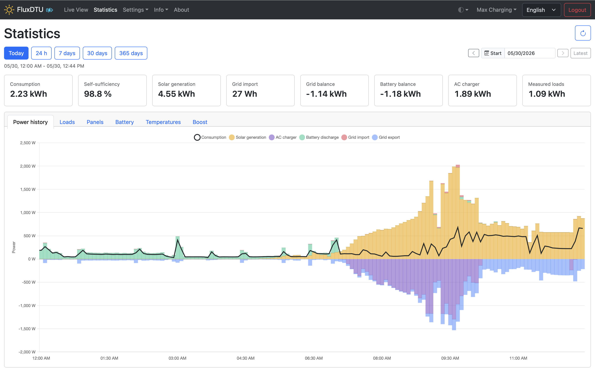
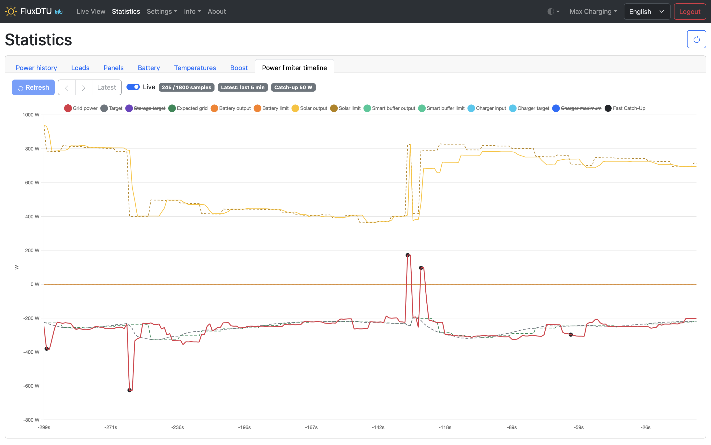
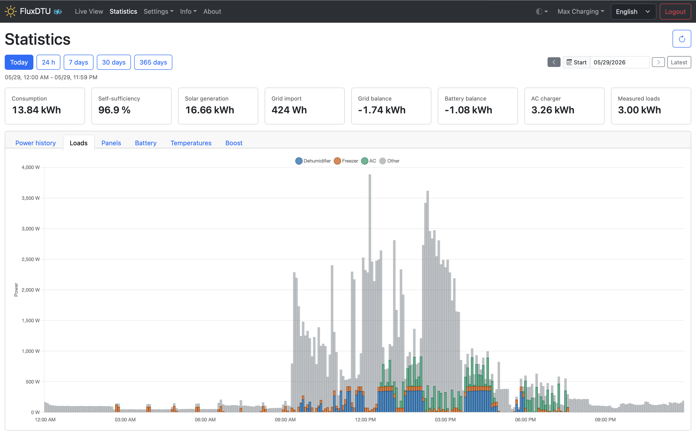

# FluxDTU

FluxDTU is an experimental fork of
[OpenDTU-OnBattery](https://github.com/hoylabs/OpenDTU-OnBattery) focused on
local battery-aware power limiting, grid charging, flexible load control, and
richer energy statistics for ESP32-based Hoymiles installations.

FluxDTU is not the official OpenDTU-OnBattery project. It builds on
OpenDTU-OnBattery and [OpenDTU](https://github.com/tbnobody/OpenDTU), but
carries fork-specific features that are developed and tested against one
real-world installation first.

## Why This Fork Exists

OpenDTU-OnBattery already adds battery chargers, battery management systems
(BMS), power meters, and a Dynamic Power Limiter to OpenDTU. FluxDTU keeps that
foundation and explores a broader local energy-control scope:

- keep grid import/export close to a configurable target,
- coordinate battery-powered inverters with an AC grid charger,
- include flexible loads in planning and statistics,
- make energy flows and temperature-related inverter behavior easier to inspect,
- iterate quickly on behavior that may be too installation-specific or too
  experimental for upstream at first.

Where changes are broadly useful, they may still be prepared for upstream
OpenDTU-OnBattery. Other changes may intentionally remain FluxDTU-specific.

## Major Additions

Compared with upstream OpenDTU-OnBattery, this fork currently carries work in
these areas:

- AC grid charger control integrated with the Dynamic Power Limiter.
- Low-latency power-limit updates that send the next inverter limit after at
  most one auto-ack response and without waiting for a pulled reply, reducing
  observed limit-setting latency to about 3 seconds in the test installation.
- Dynamic grid target handling, including battery/storage target offsets.
- Operation profiles for switching complete runtime configurations.
- Flexible load support with feed-in priorities, preserved state, measured load
  power, and statistics integration.
- More detailed statistics views, including panel statistics, average battery
  SoC, planned SoC, battery boost information, indexed range navigation, and
  battery inverter temperature data.
- Inverter recovery and limit-refresh behavior for installations where
  individual inverters can become stale, unreachable, or thermally constrained.

This list is descriptive, not a stability guarantee. Some features are actively
being tuned.

## Statistics Example

The statistics view combines daily energy totals with tabbed charts for power
history, loads, panels, battery behavior, temperatures, and boost operation.

The power limiter timeline makes FluxDTU's ultra-fast transient response
visible. The timeline marks short grid-power excursions and the immediate limit
reaction that follows; in the test installation this closes transients in a few
seconds, roughly an order of magnitude faster than the regular OpenDTU /
OpenDTU-OnBattery polling and control path.

The loads tab demonstrates flexible-load statistics by splitting measured load
power into configured categories while keeping the daily measured-load total
visible alongside the rest of the energy balance.

## Project State

FluxDTU is maintained as an experimental public fork. It is used on a real
installation, but it is not validated across the full range of hardware and
configuration combinations supported by upstream OpenDTU-OnBattery.

Bug reports, comments, and pull requests are welcome, especially when they come
with clear hardware details, configuration context, and reproducible behavior.

## Inverter Firmware Compatibility

Avoid inverter firmware version **2.0.4** for setups that depend on power limit
control.

| Version | PDL\*) | Temporary Limit | Persistent Limit | Recommendation                  |
|:--------|:------:|:---------------:|:----------------:|---------------------------------|
| 1.0.x   | no     | yes             | yes              | Good option if PDL not required |
| 1.1.12  | yes    | yes             | yes              | Best option                     |
| 2.0.4   | no     | no              | yes              | Avoid/downgrade                 |

\*) PDL = Power Distribution Logic, i.e. the inverter's ability to limit the
inputs individually to achieve the desired AC output power.

Firmware 2.0.4 can report a 100% power limit after a few minutes without limit
updates, which can break Dynamic Power Limiter behavior.

## Documentation

Most firmware and hardware documentation is still inherited from upstream
OpenDTU-OnBattery:

- [OpenDTU-OnBattery documentation](https://opendtu-onbattery.net)
- [OpenDTU-OnBattery wiki](https://github.com/hoylabs/OpenDTU-OnBattery/wiki)
- [OpenDTU-OnBattery releases](https://github.com/hoylabs/OpenDTU-OnBattery/releases)

FluxDTU-specific notes live in this repository's [docs](docs/) directory. They
document fork-specific behavior where the upstream documentation does not apply.

## Building

FluxDTU uses the same general build layout as OpenDTU-OnBattery: an ESP32
firmware project with a Vue-based web application embedded into the firmware.

Unlike the original upstream OpenDTU project, the web application must be built
when compiling firmware locally. See the inherited
[compile web app documentation](https://opendtu-onbattery.net/firmware/compile_webapp/)
for the upstream build flow.

## Compatibility Notes

FluxDTU keeps several inherited compatibility names on purpose:

- some configuration keys still contain `onbattery`,
- Prometheus metrics and MQTT topics may still use `opendtu` prefixes,
- OpenDTU Fusion remains the name of a supported hardware family,
- upstream OpenDTU and OpenDTU-OnBattery links remain in historical and
  attribution contexts.

Those names are part of existing integrations or project history and are not all
renamed to FluxDTU.

## Project History

The original OpenDTU project was started from a
[discussion on Mikrocontroller.net](https://www.mikrocontroller.net/topic/525778)
with the goal of replacing the original Hoymiles DTU and avoiding Hoymiles'
cloud. The Hoymiles protocol was decrypted and analyzed through substantial
reverse engineering work.

OpenDTU-OnBattery was started by
[@helgeerbe](https://github.com/helgeerbe) as a fork of OpenDTU to add battery
charger support and a Dynamic Power Limiter. In October 2024,
OpenDTU-OnBattery moved to the `hoylabs` GitHub organization.

FluxDTU is a downstream experimental fork of that work.

## Acknowledgments

- Thanks to Thomas Basler ([@tbnobody](https://github.com/tbnobody)), the
  author of [OpenDTU](https://github.com/tbnobody/OpenDTU).
- Thanks to [@helgeerbe](https://github.com/helgeerbe) and all
  OpenDTU-OnBattery contributors for building the foundation this fork is based
  on.
- Thanks to the broader OpenDTU, OpenDTU-OnBattery, AhoyDTU, and Hoymiles
  reverse-engineering communities.
